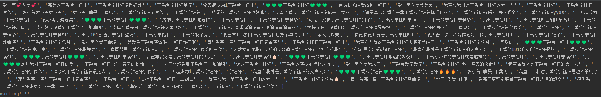
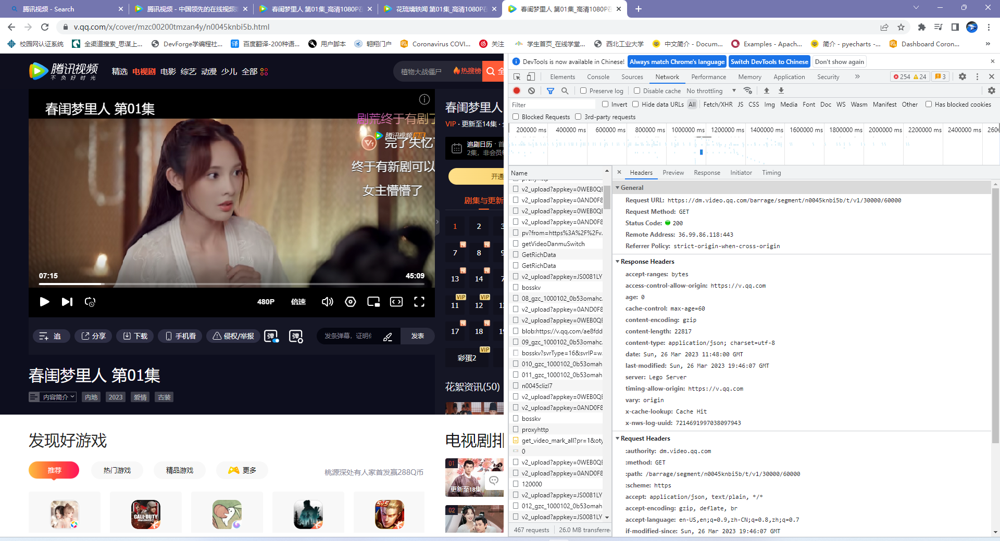
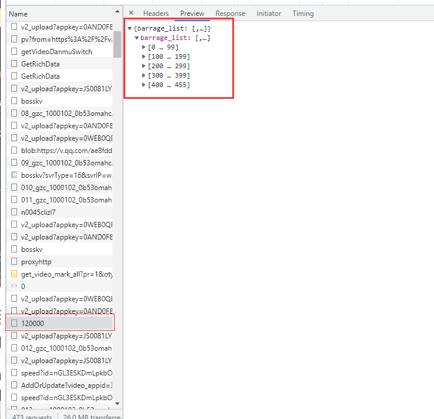
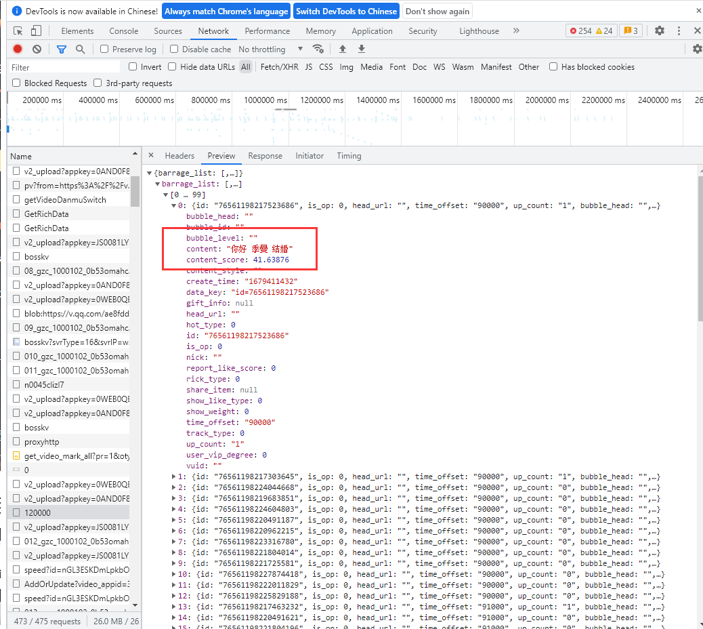
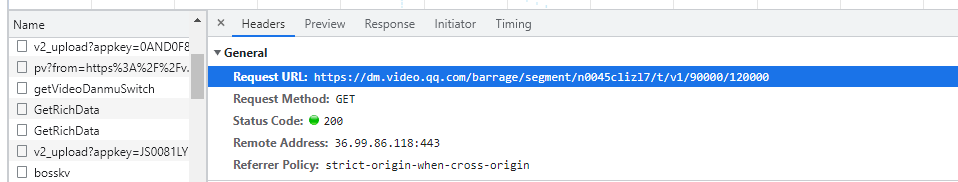
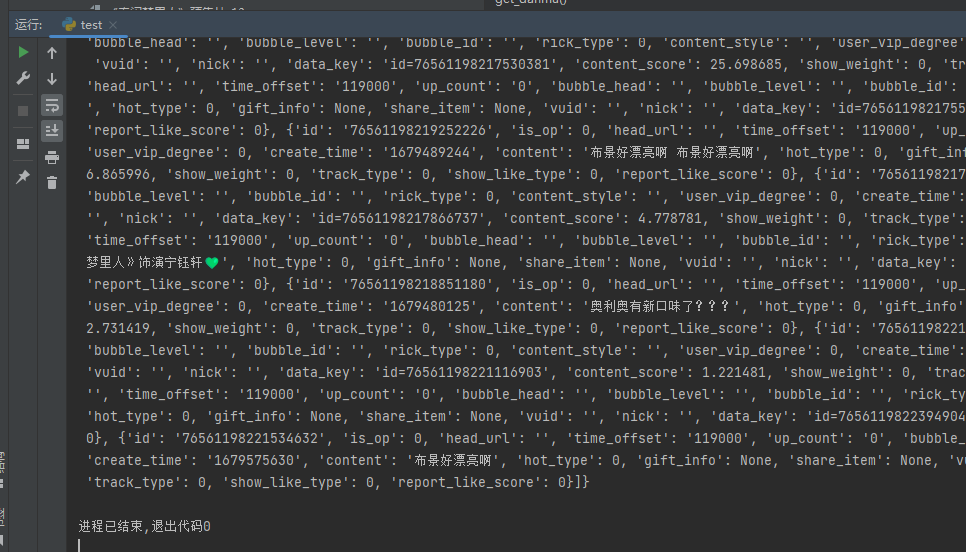
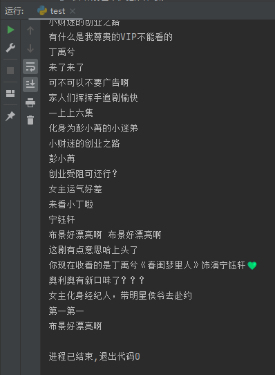
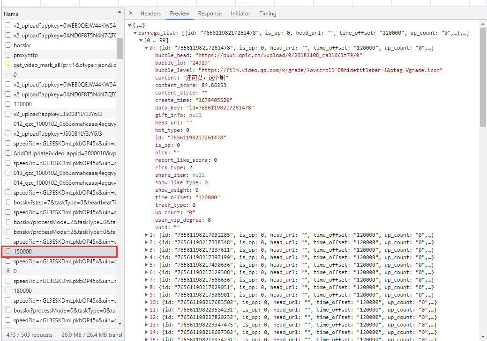
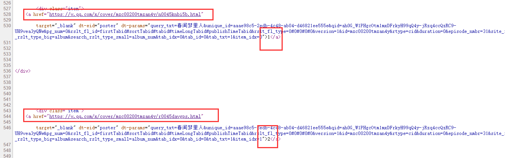
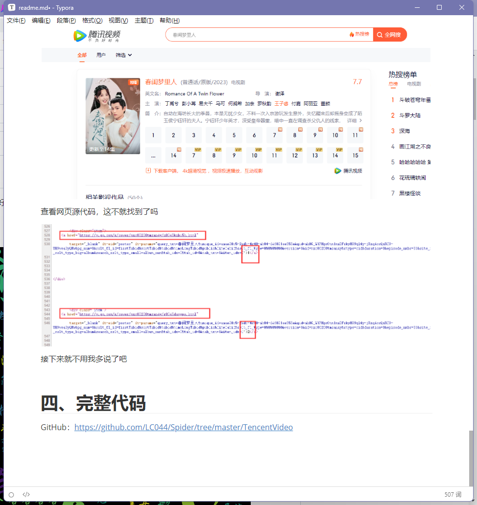

# 一、前言

大家都看视频的时候会发现有好多人在弹幕区讨论视频内容，你有没有好奇过大家都在弹幕里说些什么，接下来这一篇文章就教你如何获取腾讯视频弹幕并将弹幕做成词云图。

运行结果《春闺梦里人》：




# 二、定位数据

第一步肯定是F12抓取网站数据，先看看有没有可以利用的数据



找啊找，终于发现一点端倪，这个东西好像有点意思，点开看看



这不就是我们想要的数据吗，so easy啊



找到URL，试试看能不能get到json数据



```Python
import requests
url = 'https://dm.video.qq.com/barrage/segment/n0045clizl7/t/v1/90000/120000'
resp = requests.get(url)
print(resp.json())
```



这也太简单了吧，连防爬措施都没有

先解析一下

```Python
def get_danmu(url):
    resp = requests.get(url)
    barrage_list = resp.json()['barrage_list']
    content = []
    for danmu in barrage_list:
        print(danmu['content'])
        content.append(danmu['content'])
```



这就搞定了？再看看



再往下翻还有很多弹幕，提取这些URL对比一下

https://dm.video.qq.com/barrage/segment/n0045clizl7/t/v1/0/30000

https://dm.video.qq.com/barrage/segment/n0045clizl7/t/v1/30000/60000

https://dm.video.qq.com/barrage/segment/n0045clizl7/t/v1/60000/90000

https://dm.video.qq.com/barrage/segment/n0045clizl7/t/v1/90000/120000

https://dm.video.qq.com/barrage/segment/n0045clizl7/t/v1/120000/150000

规律这不就来了吗，后面两个/数字是30000的倍数

那最后一个是多少呢，不知道，30000*15?

https://dm.video.qq.com/barrage/segment/n0045knbi5b/t/v1/420000/450000

管他呢，多请求几次，等到请求结果为空就停止

```Python
i = 1
while True:
    num = 30000 * i
    url = f'https://dm.video.qq.com/barrage/segment/n0045clizl7/t/v1/{num - 30000}/{num}'
    content = get_danmu(url)
    if not content:
        break
    i += 1
```

这集电视剧弹幕就搞定了

# 二、获取targetID

URL后面的数字解决了，那前面的一串n0045clizl7字符是什么东西

观察一下就会发现，这俩不是一个东西吗


那这个targetID从哪来呢？

这时候就要返回一级从外面看了

搜一下


查看网页源代码，这不就找到了吗



接下来就不用我多说了吧


# 四、完整代码

GitHub：https://github.com/LC044/Spider/tree/master/TencentVideo

